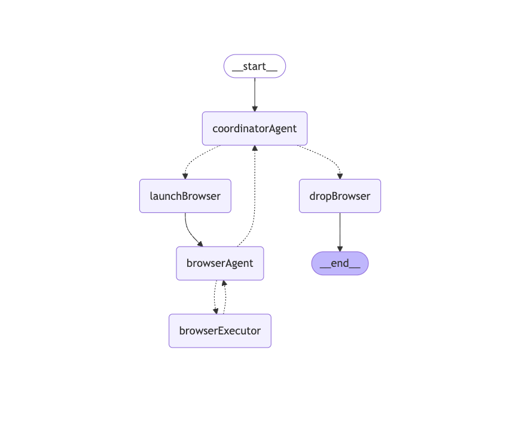
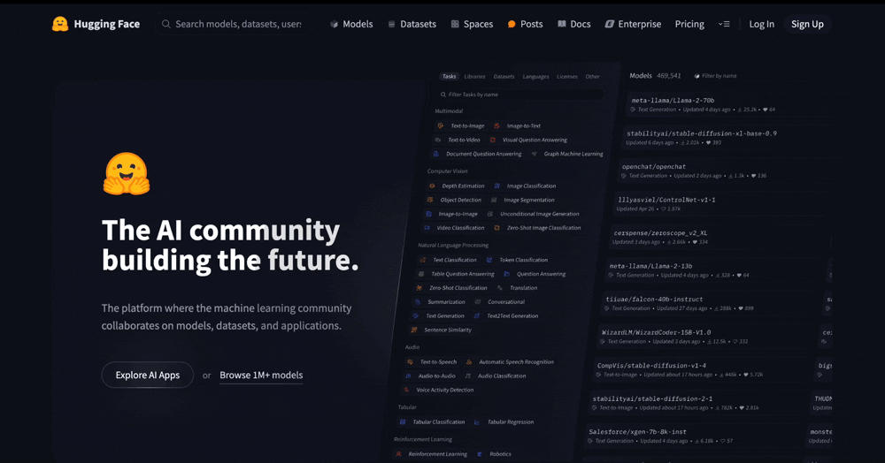

# Experimental browser-use 

基于 puppeteer 与 视觉模型，探索并实现类 `browser-use` 能力。

<div align="center">
  
</div>

注意：

- 这是一个实验性学习项目，不具备生产环境使用能力
- 意图识别部分，没有扩展能力，不具备自动识别 url 能力，预期目标是作为 agent 或者 tool 集成到整体 LLM 应用中
- 研发框架采用 langchain.js、langgraph.js
- 使用模型:
  - 视觉模型: `qwen-vl-max-latest` (基于阿里云部署的 qwen-vl 模型，新用户免费赠送 tokens 基本无需付费)
  - 文本模型: `mistral-large-latest` (mistral ai 提供无限 token 的免费账户)
- 其他依赖：
  - 浏览器自动化: `puppeteer`
  - 追踪：`langsmith`

## 环境要求

### nodejs

- Node.js >= 18

### 配置文件 `.env`

修改 `.env.example` 为 `.env`，修改其中的 `MISTRAL_API_KEY` 、`OPENAI_API_KEY` 、`LANGSMITH_API_KEY` 为你的密钥。

### 安装依赖

```bash
pnpm install
```

## 启动并测试

你可以在 `src/index.ts` 中修改测试用例，然后执行：

```bash
pnpm run dev
```

## Demo

> open huggingface.co, search deepseek, find the deepseek-r1 model, extract the number of downloads last month

