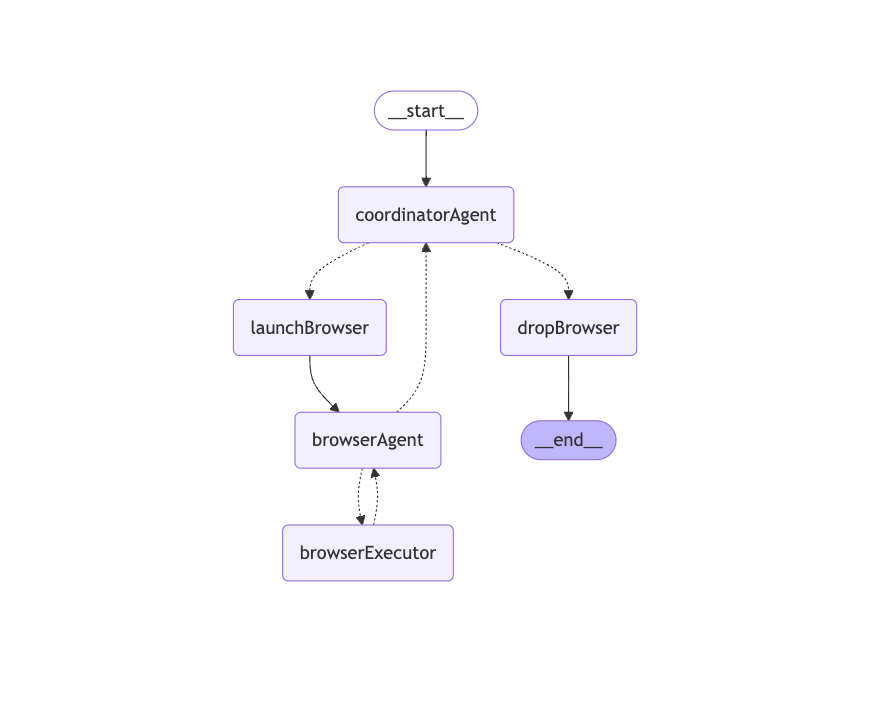
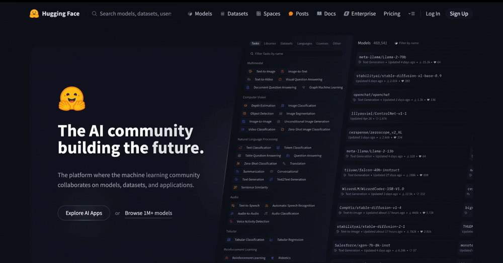

# Experimental browser-use 

Explore and implement `browser-use` capabilities based on puppeteer and vision models.

This project draws inspiration from some of the designs of the [midscene](https://github.com/web-infra-dev/midscene) project.

<div align="center">
  
</div>

**Notes:**
- This is an experimental learning project and not production-ready
- The intent recognition module lacks extensibility and URL auto-detection capabilities. It's designed to be integrated as an agent/tool into LLM applications
- Development framework: langchain.js + langgraph.js
- Models used:
  - Vision model: `qwen-vl-max-latest` (Qwen-VL model deployed on Alibaba Cloud, new users get free tokens)
  - Text model: `mistral-large-latest` (Mistral AI's free account with unlimited tokens)
- Dependencies:
  - Browser automation: `puppeteer`
  - Tracing: `langsmith`

## Environment Requirements

### Node.js
- Node.js >= 18

### Configuration File `.env`
Rename `.env.example` to `.env` and configure:
- `MISTRAL_API_KEY`
- `OPENAI_API_KEY` 
- `LANGSMITH_API_KEY`

### Install Dependencies

```bash
pnpm install
```

## Start and Test
You can modify the test cases in `src/index.ts`, then run:
```bash
pnpm run dev
```
## Demo

> Input: open huggingface.co, search deepseek, find the deepseek-r1 model, extract the number of downloads last month

